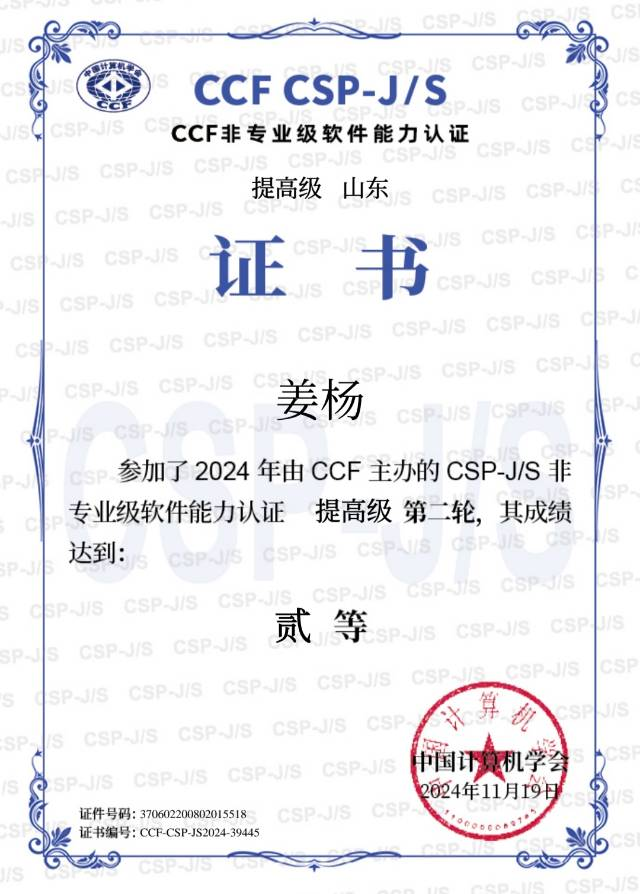

## Hi there👋
这里是lkkllk，是一只可爱的男孩子哦~

- 我的名字是随便起的，所以想怎么称呼我都可以啦（也许lk就可以？）
- 现在是一名中国体制内准高三生TvT
- 是退役OIer，然而只拿到一个CSP-S二等奖（我为什么要在NOIP写assert啊啊啊）
- 仍然在探索自我ing...
- 超喜欢闺蜜！！（但是她没有github）

## Skills
- 我熟悉的：
	
	外加x86架构逆向工程
- 用过但不熟悉的：
	

## Contract
来找我聊天好嘛 ~~（卑微）（探头）（试图撒娇以吸引注意）~~
- Wechat : wxid\_irlzitl8y94h22
- QQ : 2936401388

注：我是社恐，真的

## State
~~我原本想把这段注释掉的~~

## Others

